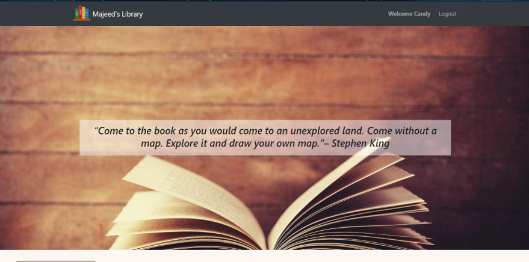
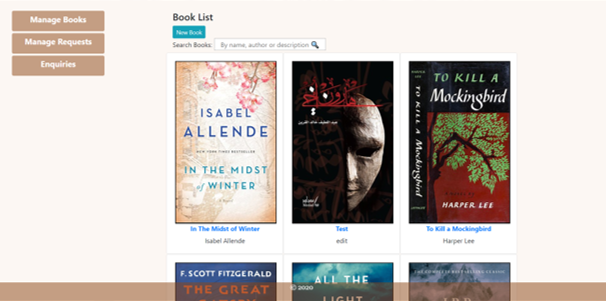
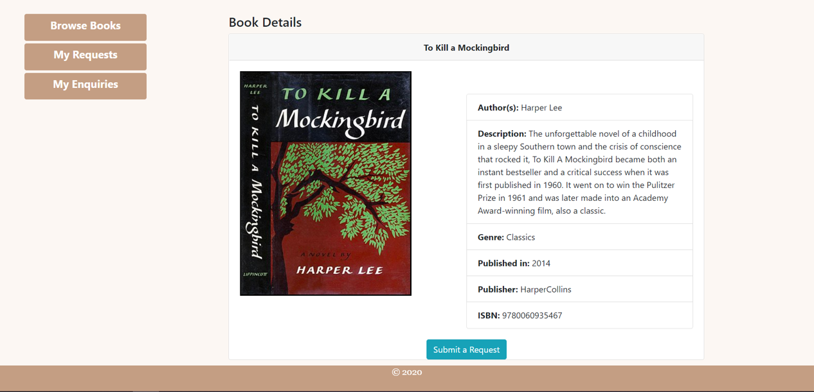
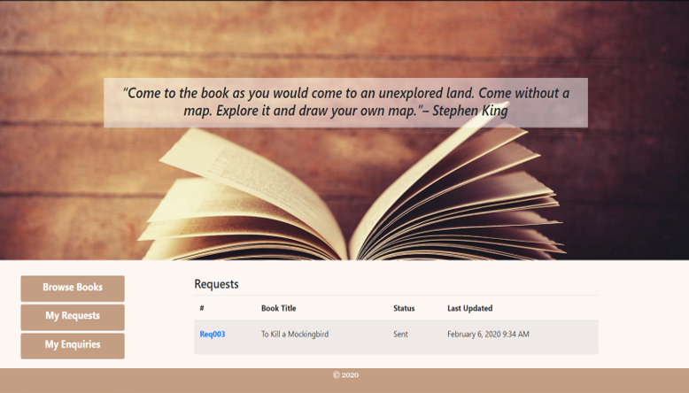
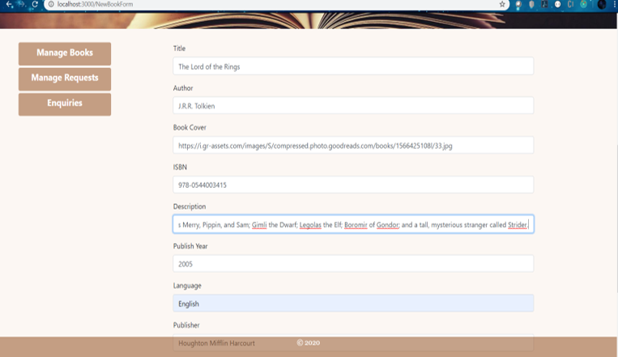
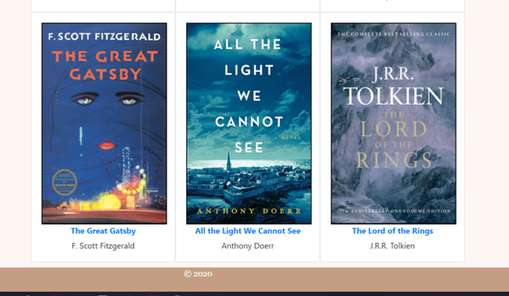

[](https://generalassemb.ly/education/web-development-immersive)


### GA's SEI Course Project #4: Full-Stack Application

# Majeed's Library

## Overview
Majeed's Library system allows admins to manage books, by adding , updating deleting and viewing them.Along with the ability to answer user's questions and manage their requests to borrow books (beta). 

## Installation
To install the project and run it locally, first fork and clone this repository then use git bash terminal to run the command
``` npm install ``` followed by ``` npm install client ``` and finally ``` npm run dev ``` to run both front and back ends concurrently in the development mode.

## Technologies Used
* React
* Express
* Node JS
* MongoDB Atlas
* Redux
* Reactstrap
* React Bootstrap
* axios


## Models
* User
* Book
* Request
* Enquiry
* Address

## Features
* User Authentication
* Password Encryption
* Ability to Create, Read, Update and Delete Books
* Create and Update requests
* Create and Update user-asked questions
* Different functions for a user and an Admin

## User Stories
#### As a registered user, I should be able to:
*	View Books
*	Submit Borrow Requests
*	View the list/status of my borrow requests
*	Make an inquiry 
*	View the list/status of my enquiries
*	Search for books

#### As an admin, I should be able to:
*	Add/ view / edit/ remove Books
*	View / update users’ requests (accept/reject)
*	View/ update (answer) users’ questions.

#### As a guest user, I should be able to:
*	View Books
*	Search for books

## Screenshots

# </img>
# </img>
# </img>
# </img>
# </img>
# </img>

## Future Work
I'd like to continue working on making the library better by providing the following:
* Email vertification/ Password reset features
* Add a section for books that were published free of charge, making the library partially digital
* Fix Requests validator methods
* Link each user to a profile to save their address for future use.
* Enable managing admins


## Resources
